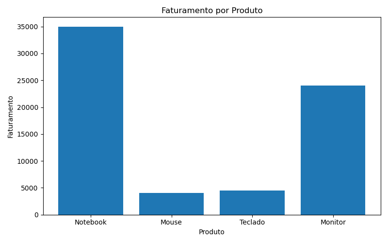

# 📊 Análise Exploratória de Vendas com Python

Este projeto foi desenvolvido como parte do meu aprendizado em **Python para Análise de Dados**.

A base de dados utilizada é fictícia e representa vendas de produtos, com o objetivo de praticar manipulação de dados, cálculos de métricas e visualizações simples.

---

## 🎯 Objetivo
- Praticar análise exploratória de dados
- Trabalhar com DataFrames utilizando Pandas
- Criar métricas como faturamento por produto
- Gerar visualizações com Matplotlib
- Organizar um projeto para portfólio no GitHub

---

## 🛠️ Tecnologias Utilizadas
- Python
- Pandas
- Matplotlib
- Jupyter Notebook

---

## 📊 Análises Realizadas
- Criação de DataFrame de vendas
- Análise inicial dos dados (`head`, `info`, `describe`)
- Cálculo de faturamento por produto
- Ranking de produtos por faturamento
- Visualização gráfica do faturamento

---

## 📈 Visualização do Projeto

### Faturamento por Produto

---

## 🚀 Considerações Finais
Este projeto representa meus primeiros passos com Python aplicado à Análise de Dados.  
Sugestões e feedbacks são sempre bem-vindos!
